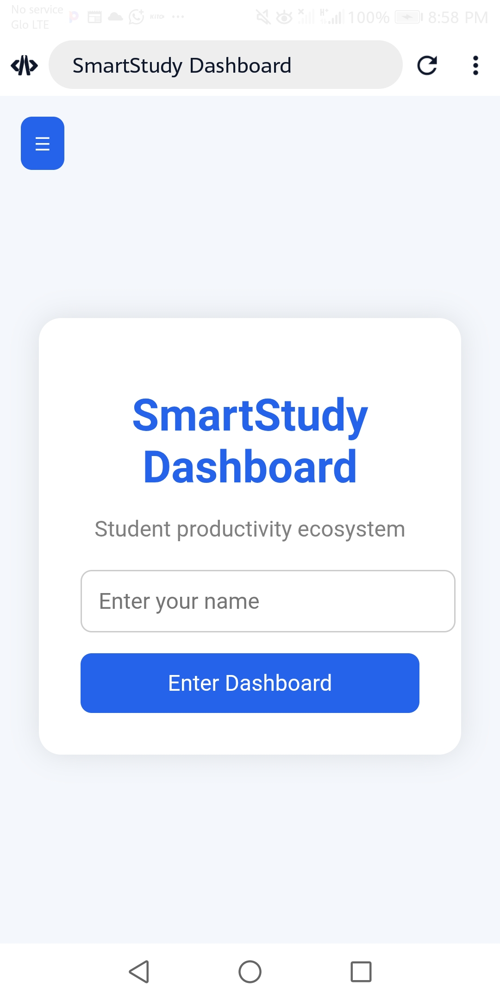
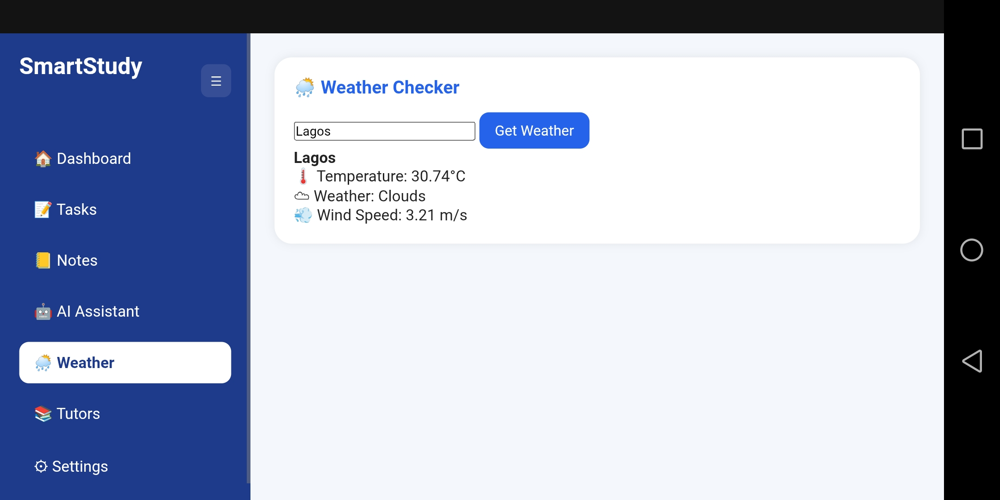

8# SmartStudy Dashboard 📚

A student productivity web application designed to help students manage tasks, study efficiently, and stay organized.

---

## 🚀 Features
- Task Manager (Add / Delete / Track tasks)
- Pomodoro Timer for focus sessions
- AI Study Assistant
- Notes System (saved in browser)
- Weather Checker
- Motivational Quotes
- Tutor Booking UI

---

## 🛠️ Tech Stack
- HTML5
- CSS3
- JavaScript (Vanilla JS)
- LocalStorage API
- OpenWeather API
  

---

## 📸 Screenshots

### Login Page

### Dashboard

### Tasks Section

### AI Assistant

### Weather Checker

### Study Notes

### Tutor Connect
 

---

## 🔗 Repo link
https://github.com/japhet996sunday-cell/smartstudy-dashboard

## 🔗 Live Demo
https://japhet996sunday-cell.github.io/smartstudy-dashboard/

---

## 👨‍💻 Developer
Japhet Sunday
